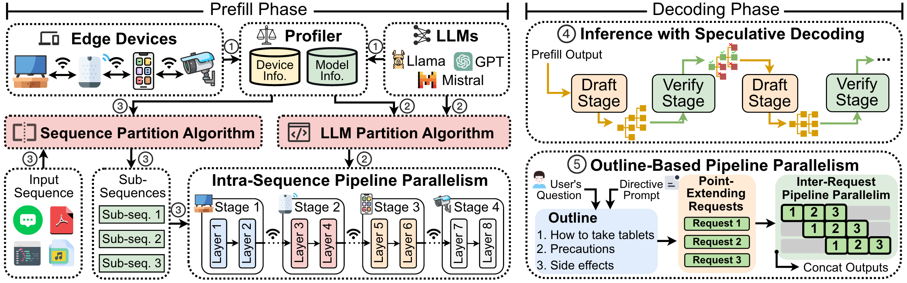
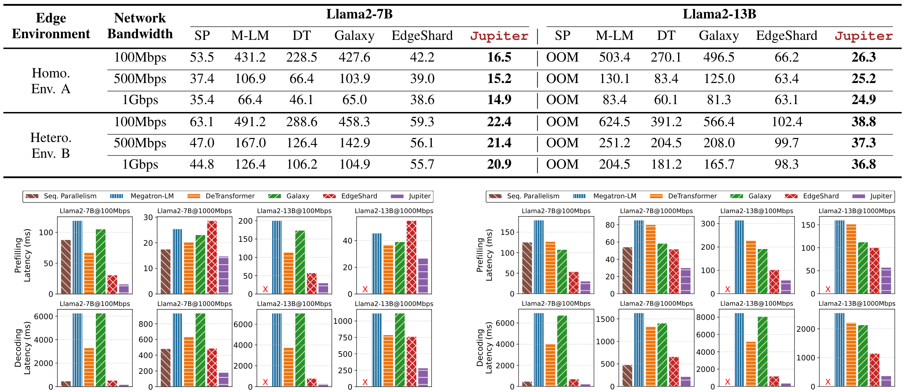

<div align="center">
  <picture>
      
  </picture>
</div>

<p align="center">
  📄 <strong>Paper:</strong> 
  <a href="https://arxiv.org/abs/2504.08242" target="_blank">[Jupiter]</a>
  &nbsp;&nbsp;|&nbsp;&nbsp;
  👨‍💻 <strong>Core Contributors:</strong>
  <a href="http://www.brandonye.tech/" target="_blank">Shengyuan Ye</a>,
  <a href="https://paprika0741.github.io/" target="_blank">Bei Ouyang</a>
</p>

<hr>

🔥 News: Our work "**Jupiter**: Fast and Resource-Efficient Collaborative Inference of Generative LLMs on Edge Devices" has been accepted by ***IEEE International Conference on Computer Communications (INFOCOM)*** 2025.

<hr>

## System Overview
***Jupiter*** is a fast, scalable, and resource-efficient collaborative edge-AI system for generative LLM inference. It adopts a flexible pipelined architecture that distinguishes system design between the prefill and decoding phases.
In the prefill stage, Jupiter introduces a novel intra-sequence pipeline parallelism to accelerate computation. In the decoding stage, it employs an outline-based pipeline decoding mechanism combined with speculative decoding, further boosting inference efficiency.

<div align="center">
  <picture>
      
  </picture>
</div>

*This repository provides an initial end-to-end demo of the system, with more internal components and performance optimizations under active development*.

## Performance Evaluation

Extensive evaluation based on realistic implementation demonstrates that Jupiter remarkably outperforms state-of-the-art
approaches under various edge environment setups achieving up to 26.1x end-to-end latency reduction while rendering onpar generation quality.

<div align="center">
  <picture>
      
  </picture>
</div>

## Acknowledgments
This project was completed at the SMCLab, Sun Yat-sen University, under the supervision of Professor [Xu Chen](https://sites.google.com/view/xcsysu/home), with remote guidance from Professor [Xiaowen Chu](https://sites.google.com/view/chuxiaowen/) at the Hong Kong University of Science and Technology (Guangzhou).

Parts of this implementation are inspired by the open-source projects [Medusa](https://github.com/FasterDecoding/Medusa) and [Skeleton-of-Thought](https://github.com/imagination-research/sot). We sincerely appreciate their valuable contributions to the community.


## Citation

```bibtex
@inproceedings{ye2025jupiter,
  title={Jupiter: Fast and resource-efficient collaborative inference of generative llms on edge devices},
  author={Ye, Shengyuan and Ouyang, Bei and Zeng, Liekang and Qian, Tianyi and Chu, Xiaowen and Tang, Jian and Chen, Xu},
  booktitle={IEEE INFOCOM 2025-IEEE Conference on Computer Communications},
  pages={1--10},
  year={2025},
  organization={IEEE}
}